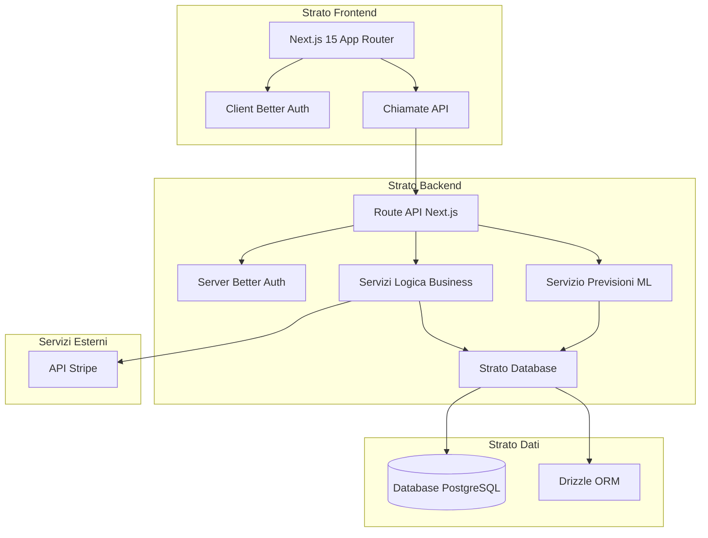
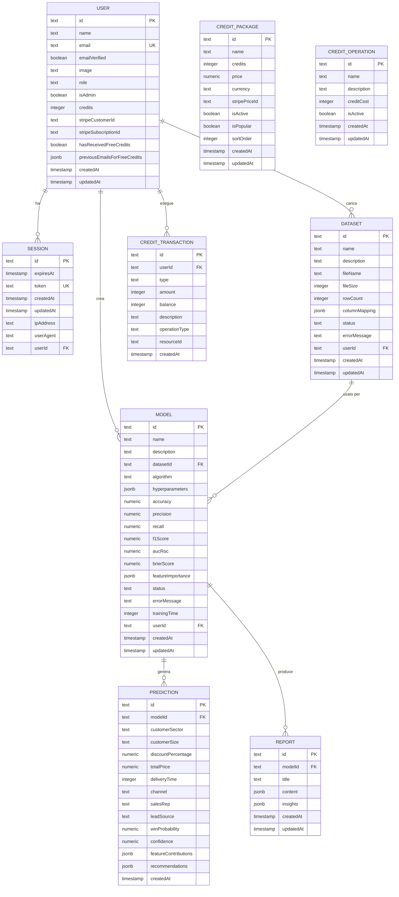
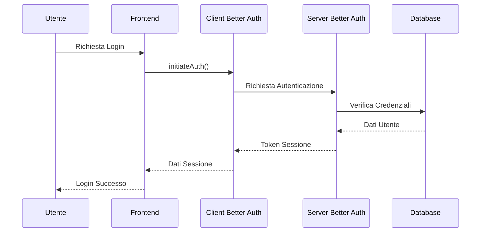
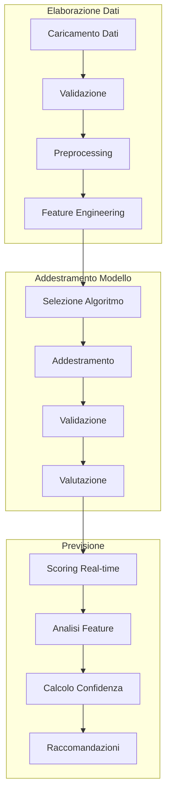
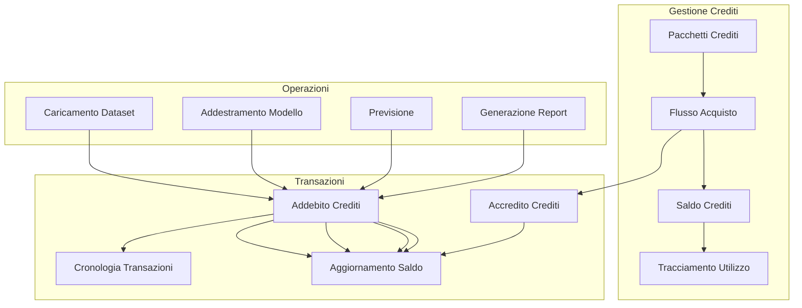
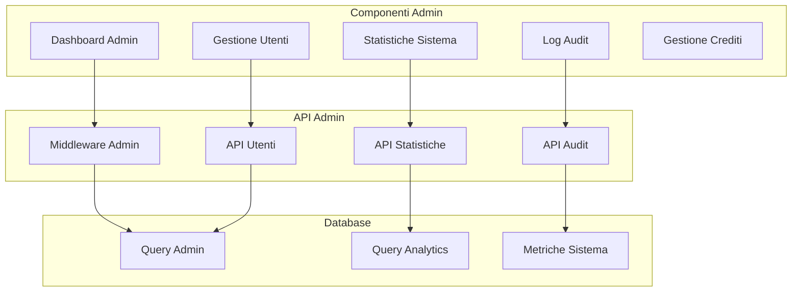
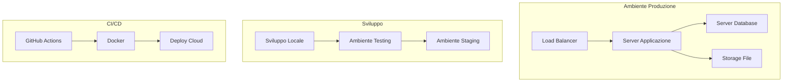
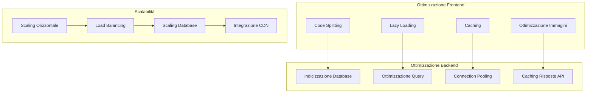
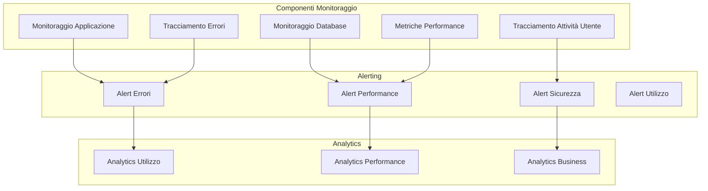

# Riepilogo dell'Architettura Tecnica di ValutAI

## Indice
1. [Panoramica Generale](#panoramica-generale)
2. [Architettura di Alto Livello](#architettura-di-alto-livello)
3. [Architettura Frontend](#architettura-frontend)
4. [Architettura Backend](#architettura-backend)
5. [Architettura Database](#architettura-database)
6. [Autenticazione e Sicurezza](#autenticazione-e-sicurezza)
7. [Pipeline di Machine Learning](#pipeline-di-machine-learning)
8. [Sistema di Crediti](#sistema-di-crediti)
9. [Sistema Admin](#sistema-admin)
10. [Deploy e Infrastruttura](#deploy-e-infrastruttura)
11. [Performance e Scalabilità](#performance-e-scalabilità)
12. [Monitoraggio e Osservabilità](#monitoraggio-e-osservabilità)

---

## Panoramica Generale

ValutAI è costruito su uno stack tecnologico moderno e scalabile, progettato per alte performance, sicurezza e manutenibilità. L'architettura segue principi di codice pulito con chiara separazione delle responsabilità tra gli strati frontend, backend e database.

### Principi di Progettazione Chiave
- **Modularità**: Ogni componente è progettato per essere distribuibile e testabile indipendentemente
- **Sicurezza**: Approccio security-first con autenticazione e autorizzazione appropriate
- **Scalabilità**: Costruito per gestire carichi utente crescenti e volumi di dati
- **Manutenibilità**: Pattern di codice pulito e test completi
- **Performance**: Ottimizzato per previsioni ML in tempo reale ed elaborazione dati

---

## Architettura di Alto Livello



### Flusso dell'Architettura
1. **Interazione Client**: Gli utenti interagiscono con il frontend Next.js
2. **Autenticazione**: Better Auth gestisce l'autenticazione degli utenti
3. **Gateway API**: Le Route API Next.js servono come punto di ingresso
4. **Logica Business**: I servizi gestiscono le operazioni business core
5. **Accesso Dati**: Drizzle ORM gestisce le interazioni con il database
6. **Elaborazione ML**: I modelli di machine learning forniscono previsioni
7. **Integrazione Esterna**: Stripe gestisce l'elaborazione dei pagamenti

---

## Architettura Frontend

### Stack Tecnologico
- **Framework**: Next.js 15 con App Router
- **Linguaggio**: TypeScript
- **Styling**: Tailwind CSS
- **Componenti UI**: Shadcn/ui
- **Autenticazione**: Better Auth
- **Gestione Stato**: React Hooks + Context API
- **Grafici**: Recharts (per implementazione futura)

### Struttura dei Componenti

```mermaid
graph TD
    subgraph "Pagine"
        A[app/page.tsx]
        B[app/dashboard/page.tsx]
        C[app/data/page.tsx]
        D[app/model/page.tsx]
        E[app/scoring/page.tsx]
        F[app/reports/page.tsx]
        G[app/credits/page.tsx]
        H[app/admin/page.tsx]
    end
    
    subgraph "Componenti"
        UI[components/ui/]
        Site[components/site-]
        Forms[components/forms/]
        Charts[components/charts/]
    end
    
    subgraph "Layout"
        Layout[app/layout.tsx]
        Header[components/site-header.tsx]
        Footer[components/site-footer.tsx]
    end
    
    Layout --> Header
    Layout --> Footer
    Pagine --> UI
    Pagine --> Site
    Pagine --> Forms
    Pagine --> Charts
```

### Funzionalità Frontend Chiave
- **Server-Side Rendering**: Ottimizzato per SEO e performance
- **Type Safety**: Implementazione TypeScript completa
- **Design Responsivo**: Approccio mobile-first
- **Flusso Autenticazione**: Autenticazione Better Auth integrata
- **Aggiornamenti Real-time**: Aggiornamenti UI ottimistici
- **Gestione Errori**: Error boundaries completi

---

## Architettura Backend

### Stack Tecnologico
- **Framework**: Route API Next.js 15
- **Linguaggio**: TypeScript
- **Runtime**: Node.js
- **Autenticazione**: Better Auth
- **Database**: PostgreSQL con Drizzle ORM
- **Caricamento File**: Gestione file nativa Next.js
- **Elaborazione ML**: Integrazione Python (futuro)

### Struttura API

```mermaid
graph TD
    subgraph "Route API"
        AuthAPI[app/api/auth/]
        UploadAPI[app/api/upload/]
        PredictionsAPI[app/api/predictions/]
        ReportsAPI[app/api/reports/]
        CreditsAPI[app/api/credits/]
        AdminAPI[app/api/admin/]
    end
    
    subgraph "Servizi"
        AuthService[/lib/auth.ts]
        CreditsService[/lib/credits.ts]
        AdminService[/lib/admin-middleware.ts]
        MLService[/lib/ml/]
    end
    
    subgraph "Database"
        Schema[/lib/schema.ts]
        Migrations[/drizzle/]
        Queries[/lib/db.ts]
    end
    
    Route API --> Services
    Services --> Database
```

### Pattern Backend Chiave
- **Pattern Middleware**: Middleware autenticazione e autorizzazione
- **Strato Servizi**: Logica business separata dalle route API
- **Pattern Repository**: Astrazione accesso dati
- **Gestione Errori**: Gestione errori centralizzata
- **Validazione**: Validazione input a più livelli

---

## Architettura Database

### Design Schema



### Funzionalità Database
- **Design Relazionale**: Relazioni foreign key appropriate
- **Supporto JSONB**: Storage flessibile per strutture dati complesse
- **Strategia Indicizzazione**: Ottimizzata per performance query
- **Gestione Migrazioni**: Sistema migrazioni Drizzle
- **Integrità Dati**: Vincoli e validazioni

---

## Autenticazione e Sicurezza

### Flusso Autenticazione



### Misure di Sicurezza
- **Hashing Password**: Storage password sicuro
- **Token JWT**: Gestione sessione stateless
- **Rate Limiting**: Protezione endpoint API
- **Configurazione CORS**: Condivisione risorse cross-origin appropriata
- **Validazione Input**: Prevenzione SQL injection e XSS
- **Variabili Ambiente**: Gestione configurazione sicura

---

## Pipeline di Machine Learning

### Architettura ML



### Componenti ML
- **Preprocessing Dati**: Pulizia e normalizzazione
- **Feature Engineering**: Estrazione feature automatica
- **Addestramento Modello**: Supporto algoritmi multipli
- **Valutazione Modello**: Metriche complete
- **API Previsione**: Scoring real-time
- **Monitoraggio Modello**: Tracciamento performance

---

## Sistema di Crediti

### Flusso Crediti



### Funzionalità Sistema Crediti
- **Gestione Pacchetti**: Pacchetti crediti flessibili
- **Saldo Real-time**: Tracciamento crediti live
- **Analytics Utilizzo**: Report consumo dettagliati
- **Addebiti Automatici**: Consumo crediti basato su operazioni
- **Integrazione Stripe**: Elaborazione pagamenti sicura

---

## Sistema Admin

### Architettura Admin



### Funzionalità Admin
- **Accesso Basato su Ruoli**: Funzionalità solo admin
- **Gestione Utenti**: Visualizza e gestisci account utente
- **Monitoraggio Sistema**: Statistiche sistema real-time
- **Amministrazione Crediti**: Gestisci pacchetti crediti e transazioni
- **Audit Trail**: Logging attività completo

---

## Deploy e Infrastruttura

### Architettura Deploy



### Stack Infrastruttura
- **Hosting**: Vercel (frontend) / AWS (backend)
- **Database**: PostgreSQL (servizio gestito)
- **Storage File**: Soluzione storage cloud
- **CDN**: Distribuzione contenuti globale
- **Monitoraggio**: Monitoraggio performance applicazione

---

## Performance e Scalabilità

### Ottimizzazione Performance



### Funzionalità Performance
- **Ottimizzazione Database**: Indicizzazione e ottimizzazione query
- **Strategia Caching**: Approccio caching multi-livello
- **Load Balancing**: Capacità scaling orizzontale
- **Integrazione CDN**: Distribuzione contenuti globale
- **Monitoraggio**: Tracciamento performance real-time

---

## Monitoraggio e Osservabilità

### Architettura Monitoraggio



### Funzionalità Monitoraggio
- **Monitoraggio Real-time**: Tracciamento salute applicazione
- **Tracciamento Errori**: Logging errori completo
- **Metriche Performance**: Tempo risposta e utilizzo risorse
- **Analytics Utente**: Pattern e comportamento utilizzo
- **Business Intelligence**: Metriche ricavo e crescita

---

## Conclusione

L'architettura di ValutAI è progettata per essere scalabile, manutenibile e sicura fornendo al contempo eccellenti performance per l'intelligence business basata su ML. Lo stack tecnologico sfrutta best practice moderni e tecnologie provate per garantire affidabilità e crescita futura.

Il design modulare permette facile estensione e modifica, mentre il monitoraggio e l'osservabilità completi garantiscono salute e performance del sistema. La separazione delle responsabilità tra strati frontend, backend e database fornisce flessibilità e manutenibilità.

Questa architettura supporta la missione della piattaforma di fornire capacità ML accessibili e potenti a imprese di tutte le dimensioni mantenendo gli standard più alti di sicurezza e performance.