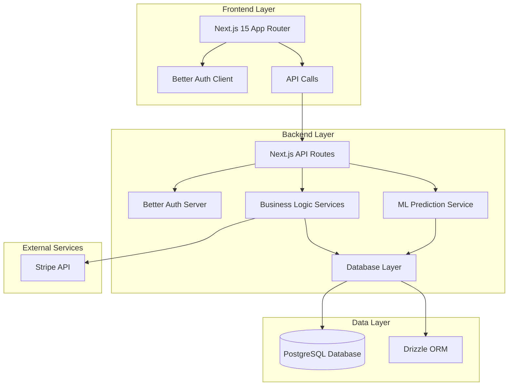
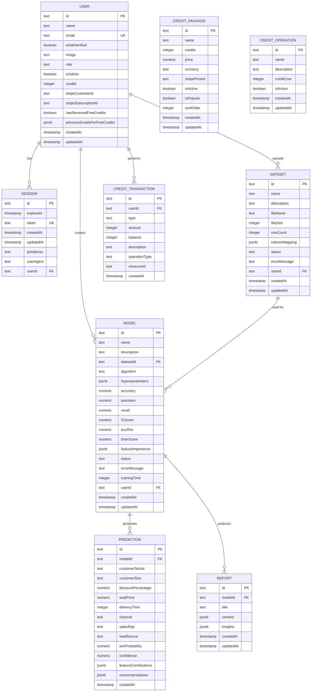
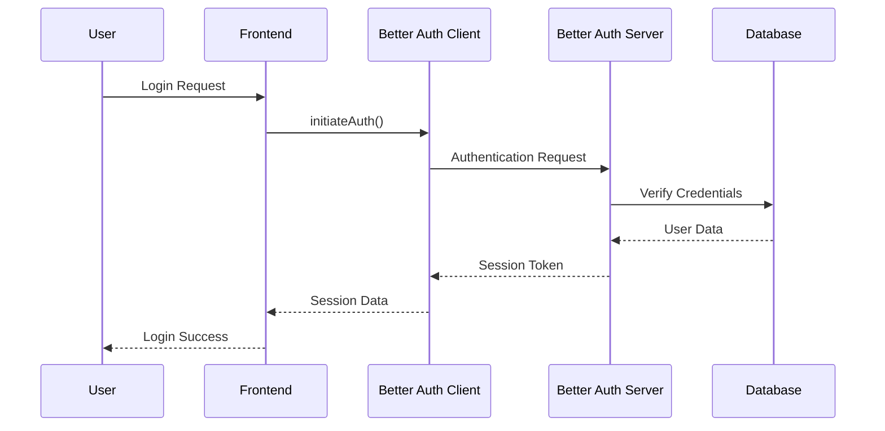
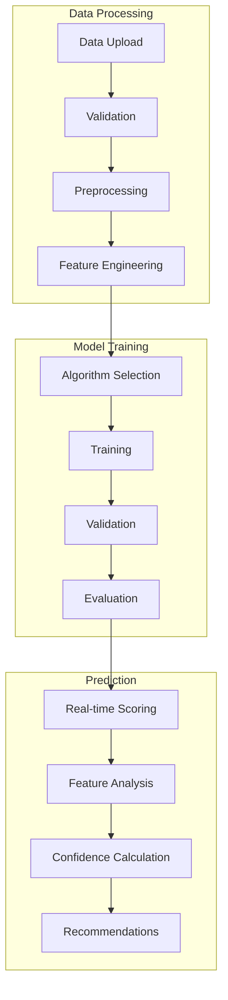
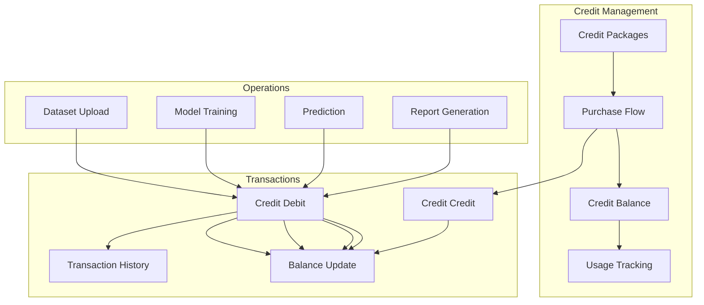
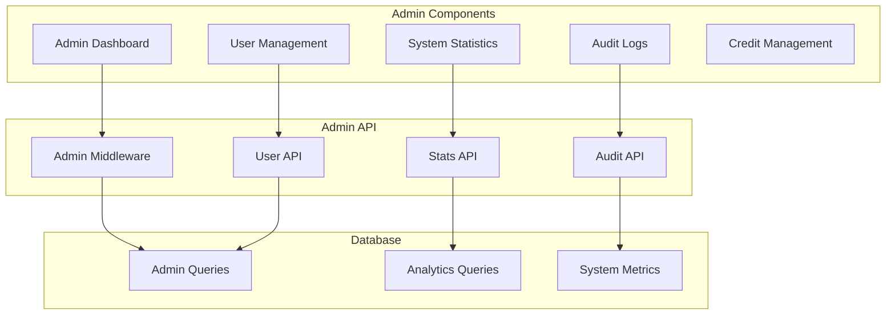
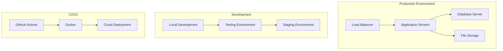
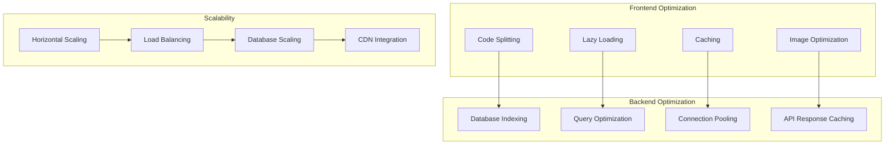
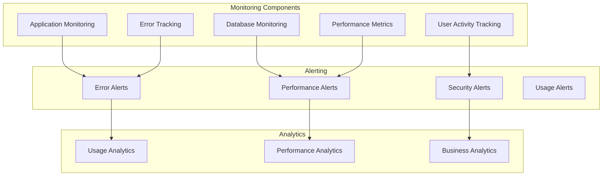

# ValutAI Technical Architecture Summary

## Table of Contents
1. [Executive Overview](#executive-overview)
2. [High-Level Architecture](#high-level-architecture)
3. [Frontend Architecture](#frontend-architecture)
4. [Backend Architecture](#backend-architecture)
5. [Database Architecture](#database-architecture)
6. [Authentication & Security](#authentication--security)
7. [Machine Learning Pipeline](#machine-learning-pipeline)
8. [Credit System](#credit-system)
9. [Admin System](#admin-system)
10. [Deployment & Infrastructure](#deployment--infrastructure)
11. [Performance & Scalability](#performance--scalability)
12. [Monitoring & Observability](#monitoring--observability)

---

## Executive Overview

ValutAI is built on a modern, scalable technology stack designed for high performance, security, and maintainability. The architecture follows clean code principles with clear separation of concerns between frontend, backend, and database layers.

### Key Design Principles
- **Modularity**: Each component is designed to be independently deployable and testable
- **Security**: Security-first approach with proper authentication and authorization
- **Scalability**: Built to handle increasing user loads and data volumes
- **Maintainability**: Clean code patterns and comprehensive testing
- **Performance**: Optimized for real-time ML predictions and data processing

---

## High-Level Architecture



### Architecture Flow
1. **Client Interaction**: Users interact with the Next.js frontend
2. **Authentication**: Better Auth handles user authentication
3. **API Gateway**: Next.js API Routes serve as the entry point
4. **Business Logic**: Services handle core business operations
5. **Data Access**: Drizzle ORM manages database interactions
6. **ML Processing**: Machine learning models provide predictions
7. **External Integration**: Stripe handles payment processing

---

## Frontend Architecture

### Technology Stack
- **Framework**: Next.js 15 with App Router
- **Language**: TypeScript
- **Styling**: Tailwind CSS
- **UI Components**: Shadcn/ui
- **Authentication**: Better Auth
- **State Management**: React Hooks + Context API
- **Charts**: Recharts (for future implementation)

### Component Structure

```mermaid
graph TD
    subgraph "Pages"
        A[app/page.tsx]
        B[app/dashboard/page.tsx]
        C[app/data/page.tsx]
        D[app/model/page.tsx]
        E[app/scoring/page.tsx]
        F[app/reports/page.tsx]
        G[app/credits/page.tsx]
        H[app/admin/page.tsx]
    end
    
    subgraph "Components"
        UI[components/ui/]
        Site[components/site-]
        Forms[components/forms/]
        Charts[components/charts/]
    end
    
    subgraph "Layout"
        Layout[app/layout.tsx]
        Header[components/site-header.tsx]
        Footer[components/site-footer.tsx]
    end
    
    Layout --> Header
    Layout --> Footer
    Pages --> UI
    Pages --> Site
    Pages --> Forms
    Pages --> Charts
```

### Key Frontend Features
- **Server-Side Rendering**: Optimized for SEO and performance
- **Type Safety**: Full TypeScript implementation
- **Responsive Design**: Mobile-first approach
- **Authentication Flow**: Integrated Better Auth authentication
- **Real-time Updates**: Optimistic UI updates
- **Error Handling**: Comprehensive error boundaries

---

## Backend Architecture

### Technology Stack
- **Framework**: Next.js 15 API Routes
- **Language**: TypeScript
- **Runtime**: Node.js
- **Authentication**: Better Auth
- **Database**: PostgreSQL with Drizzle ORM
- **File Upload**: Native Next.js file handling
- **ML Processing**: Python integration (future)

### API Structure

```mermaid
graph TD
    subgraph "API Routes"
        AuthAPI[app/api/auth/]
        UploadAPI[app/api/upload/]
        PredictionsAPI[app/api/predictions/]
        ReportsAPI[app/api/reports/]
        CreditsAPI[app/api/credits/]
        AdminAPI[app/api/admin/]
    end
    
    subgraph "Services"
        AuthService[/lib/auth.ts]
        CreditsService[/lib/credits.ts]
        AdminService[/lib/admin-middleware.ts]
        MLService[/lib/ml/]
    end
    
    subgraph "Database"
        Schema[/lib/schema.ts]
        Migrations[/drizzle/]
        Queries[/lib/db.ts]
    end
    
    API Routes --> Services
    Services --> Database
```

### Key Backend Patterns
- **Middleware Pattern**: Authentication and authorization middleware
- **Service Layer**: Business logic separated from API routes
- **Repository Pattern**: Data access abstraction
- **Error Handling**: Centralized error management
- **Validation**: Input validation at multiple layers

---

## Database Architecture

### Schema Design



### Database Features
- **Relational Design**: Proper foreign key relationships
- **JSONB Support**: Flexible storage for complex data structures
- **Indexing Strategy**: Optimized for query performance
- **Migration Management**: Drizzle migration system
- **Data Integrity**: Constraints and validations

---

## Authentication & Security

### Authentication Flow



### Security Measures
- **Password Hashing**: Secure password storage
- **JWT Tokens**: Stateless session management
- **Rate Limiting**: API endpoint protection
- **CORS Configuration**: Proper cross-origin resource sharing
- **Input Validation**: SQL injection and XSS prevention
- **Environment Variables**: Secure configuration management

---

## Machine Learning Pipeline

### ML Architecture



### ML Components
- **Data Preprocessing**: Cleaning and normalization
- **Feature Engineering**: Automatic feature extraction
- **Model Training**: Multiple algorithm support
- **Model Evaluation**: Comprehensive metrics
- **Prediction API**: Real-time scoring
- **Model Monitoring**: Performance tracking

---

## Credit System

### Credit Flow



### Credit System Features
- **Package Management**: Flexible credit packages
- **Real-time Balance**: Live credit tracking
- **Usage Analytics**: Detailed consumption reports
- **Automated Deductions**: Credit consumption based on operations
- **Stripe Integration**: Secure payment processing

---

## Admin System

### Admin Architecture



### Admin Features
- **Role-based Access**: Admin-only functionality
- **User Management**: View and manage user accounts
- **System Monitoring**: Real-time system statistics
- **Credit Administration**: Manage credit packages and transactions
- **Audit Trail**: Comprehensive activity logging

---

## Deployment & Infrastructure

### Deployment Architecture



### Infrastructure Stack
- **Hosting**: Vercel (frontend) / AWS (backend)
- **Database**: PostgreSQL (managed service)
- **File Storage**: Cloud storage solution
- **CDN**: Global content delivery
- **Monitoring**: Application performance monitoring

---

## Performance & Scalability

### Performance Optimization



### Performance Features
- **Database Optimization**: Indexing and query optimization
- **Caching Strategy**: Multi-layer caching approach
- **Load Balancing**: Horizontal scaling capability
- **CDN Integration**: Global content delivery
- **Monitoring**: Real-time performance tracking

---

## Monitoring & Observability

### Monitoring Architecture



### Monitoring Features
- **Real-time Monitoring**: Application health tracking
- **Error Tracking**: Comprehensive error logging
- **Performance Metrics**: Response time and resource usage
- **User Analytics**: Usage patterns and behavior
- **Business Intelligence**: Revenue and growth metrics

---

## Conclusion

ValutAI's architecture is designed to be scalable, maintainable, and secure while providing excellent performance for ML-powered business intelligence. The technology stack leverages modern best practices and proven technologies to ensure reliability and future growth.

The modular design allows for easy extension and modification, while the comprehensive monitoring and observability ensure system health and performance. The separation of concerns between frontend, backend, and database layers provides flexibility and maintainability.

This architecture supports the platform's mission to provide accessible, powerful ML capabilities to businesses of all sizes while maintaining the highest standards of security and performance.